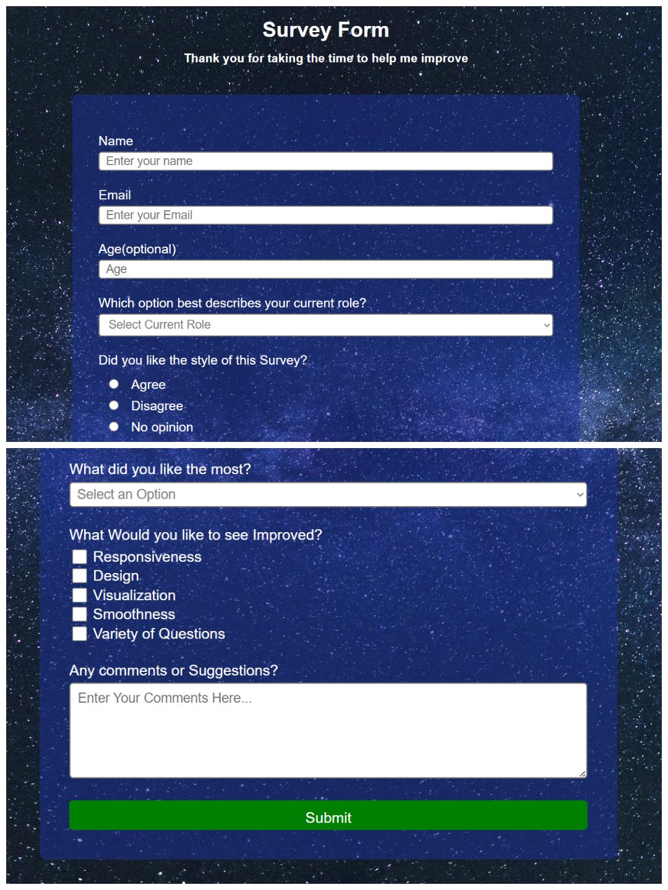

<div align="center">

# 📝 Responsive Survey Form

<p>A clean and mobile-responsive survey form built with modern HTML5 and CSS3. This project demonstrates a strong understanding of responsive design principles, ensuring a seamless user experience across all devices, from mobile phones to widescreen desktops.</p>

</div>

<p align="center">
  
</p>

---

## 🚀 Live Demo

You can view and interact with the live version of the project here:

**https://survey-form-tried.netlify.app/**

---

## ✨ Core Features

-   **Fully Responsive Design:** The layout fluidly adapts to any screen size, providing an optimal viewing experience for every user.
-   **Clean & Modern UI:** A visually appealing design with a focus on readability and user-friendliness, featuring a transparent container over a background image.
-   **Variety of Input Types:** Demonstrates the use of various form elements, including text inputs, dropdown menus, radio buttons, checkboxes, and a textarea.
-   **Natural Document Flow:** Built without absolute positioning, relying on a natural and robust block layout that prevents content distortion on resize.

---

## The Problems I faced while developing and how I fixed them :-

-   **Rigid vs. Responsive Layout**: I initially used a fixed-pixel values and absolute positioning which created a rigid layout that cant adapt to different screen sizes. I refactored it to        be fully responsive using a fluid container and a natural document flow, learning the importance of a mobile-first approach.

-   **HTML Structure**: A persistent bug led me to discover I had incorrectly nested elements in my HTML. Debugging and fixing the structure taught me that clean, semantic HTML is the               essential foundation for predictable CSS.

## 🛠️ Technologies & Tools

This project was built using core front-end technologies, with a focus on creating a flexible and maintainable structure.

<p align="center">
  
  
  
</p>

---

## ⚙️ How To Run Locally

To get a local copy up and running, follow these simple steps.

```bash
# 1. Clone the repository
git clone [https://github.com/your-username/your-repo-name.git](https://github.com/your-username/your-repo-name.git)

# 2. Navigate into the project directory
cd your-repo-name

# 3. Open index.html in your browser
